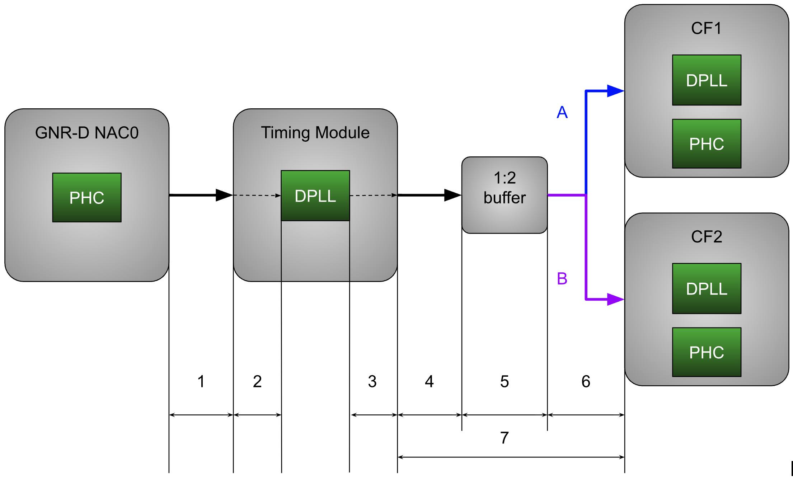

# Delay compensation model

This document proposes a layered model for phase delay compensation for implementation in precision timing operator.

JIRA: [https://issues.redhat.com/browse/CNF-20638](https://issues.redhat.com/browse/CNF-20638)	

# Introduction	

## Goals

1. The model is easy to understand, represent in configuration files (YAML) and implement in software  
2. The model should specify the way the delay information is provided for each route segment, since different segments of the route are under different responsibilities. For example, DPLL module delays can be provided by DPLL driver, NIC delays by NIC driver, routing delays by hardware manufacturers through BIOS, and external cables and custom adjustments by user through configuration files

## Approach

The approach proposed here is built on the top of three layers.

* **Topology** \-  the immutable physical graph of components and connections, establishing the structural "hardware truth"   
* **Physics** \- a layer on the top of the topology, which assigns specific latency values to different propagation segments   
* **Intent**  \- layer that defines the signal flows and delay compensation policies, decoupling physical reality from control logic 

This separation allows us to model passive nodes for total latency observability while flexibly assigning "compensation checkpoints" to neutralize accumulated delay at arbitrary stages of the signal path.

## 

## Illustrative example \- GNR-D Telecom Boundary Clock with follower NICS 
 
### 1\. Layer 1: Topology (The Connectivity)

This layer defines the static hardware inventory, wiring and directions. It answers the question “What connects to what”. We use graph theory terminology of nodes and edges. 

* **Nodes:**   
  * NAC  
  * Timing module input connector  
  * DPLL input pin  
  * DPLL output pin  
  * Timing module output connector  
  * Buffer / Splitter input pin  
  * Buffer / splitter output pin  
  * Carter flats  
* **Edges:**  
1. NAC to Timing Module routing / wiring.   
2. Timing module internal routing from the connector input pin to the DPLL input pin.   
3. Timing  module internal routing from the DPLL output pin to the connector output pin.   
4. Timing module to the Buffer / Splitter routing  
5. Internal Buffer / Splitter switching delay  
6. Buffer / Splitter to CF1 and CF2 delay. The delay is assumed to be identical on path A and path B.  
7. Overall delay from Timing module output connector to CF that can be modeled for simplicity. Since neither CF nor Buffer / Splitter are manageable, the entire Edge 7 is a sum of edges 4, 5 and 6\. 

### 2\. Layer 2: Physics (The Latency)

This layer maps measurable physical properties to the topology. It answers "What is the cost of traversal?",  and also “Who is responsible to measure and provide this number?” 

| Edge | Value | Note |
| :---- | :---- | :---- |
| NAC to Timing Module PTP phase delay | 5700ps (Dell spreadsheet. probably includes the timing module) 2185ps (Intel pres) \*Note 1 | Responsibility \- hardware manufacturer (DELL) Exposed by? |
| Timing module internal routing from the connector input pin to the DPLL input pin | 129ps (Intel pres) \*Note 1 | Responsibility \- timing module manufacturer (Microchip) Exposed by the timing module driver? |
| Timing  module internal routing from the DPLL output pin to the connector output pin | 152 (Intel pres) \*Note 1 |  |
| Overall delay from Timing module output connector to CF | 6732 (Dell spreadsheet, probably includes the timing module above) \*Note 1 | Responsibility \- hardware manufacturer (DELL) Exposed by? |
| Note 1: Specific delays and topology are subject to change per platform generation |  |  |

#### 

### 3\. Layer 3: Intent (The Compensation Strategy)

This layer defines how the system compensates for the effects introduced by physics. 

We define a **Route** (the specific sequence of interest) and a **Compensation Strategy**.

| Route | Strategy | Designated compensator | Configuration |
| :---- | :---- | :---- | :---- |
| NAC to DPLL input | Input side compensation | DPLL REF0 input \*Note 1  | User space will sum 5700ps and 129ps, and dial \-5829 ps of phase adjustment (rounded to the nearest phase adjustment granularity) to the designated compensator |
| DPLL to CF (unmanaged inputs) | Output side compensation | DPLL OUT5 output \*Note 1 | User space will sum 6732ps and 152ps, and dial \-6884 ps of phase adjustment (rounded to the nearest phase adjustment granularity) to the designated compensator |
| Note 1: Specific numbers, labels and pins are subject to change per platform generation |  |  |  |

#### 

# Information model

```json
# 1. Inventory - static phase transfer nodes
components:
  - id: "NAC0 PTP phase output"
  - id: "Timing module input connector"
  - id: "DPLL 1kHz input"
    # compensationPoint is only required for compensators, see below
    compensationPoint: 
      name: "REF0"
      type: dpll 

  - id: "DPLL ePPS OUT5"
    compensationPoint: 
      name: "OUT5"
      # type can be either "dpll" or in the future (only for non-dpll 
      # compensation points) "FSWrite" (in which case the path and formatting should be configured).
      # optional, default - "dpll".
      type: dpll

  - id: "Timing module ePPS out"
  - id: "Carter Flats ePPS in"


# 2. Topology: Physical connections (graph edges)
connections:
  - from: "NAC0 PTP phase output"
    to: "Timing module input connector"
    # When provided by the platform, this part specifies how to get the delay
    getter:
      FSRead:
        path: "/sys/class/.../.../delay"
    # Pre-coded fallback default for when not provided by the platform
    delayPs: 5700
# Etc.
  - from: "Timing module input connector"
    to: "DPLL 1kHz input"
    delayPs: 129
  - from: "DPLL ePPS OUT5"
    to: "Timing module ePPS out"
    delayPs: 152
  - from: "Timing module ePPS out"
    to: "Carter Flats ePPS in"
    delayPs: 6732

# 3. Logic: Where do we compensate for the delay
routes:
  - name: "NAC PTP to DPLL"
    sequence: ["NAC0 PTP phase output", "Timing module input connector", "DPLL 1kHz input"]
    compensator: "DPLL 1kHz input"

  - name: "DPLL to CF"
    sequence: ["DPLL ePPS OUT5", "Timing module ePPS out", "Carter Flats ePPS in"]
    compensator:"DPLL ePPS OUT5"
```

# Flow

The procedure below is invoked on every PtpConfig or HardwareConfig resource (re)configuration

```
for each connection in connections:
    initialize delays (from platform values or overrides)

for each route in routes:
    compensation = sum(segment.cost for segment in route.sequence)
    # User adjustments are applied via HardwareConfig phaseAdjustment field

    for each component in components:
        if component.ID == route.compensator.ID:
            compensationPoint = {
                name: component.compensationPoint.name,
                type: component.compensationPoint.type
            }
            break

    # Apply compensation to compensationPoint (by name and type)
    # Currently only DPLL compensators are supported, which are always applied statically
  
```

# Configuration Guide

## Overview

Delay compensation is configured through two layers:

1. **Vendor-defined delays** (`delays.yaml`): Hardware-specific delay values defined by the vendor/manufacturer
2. **Integrator adjustments** (`HardwareConfig`): User-defined adjustments for external cables and custom calibration

The system automatically calculates internal delays from `delays.yaml` and combines them with user-provided adjustments to determine the final phase compensation value.

## Vendor-Defined Delays (`delays.yaml`)

Vendor-defined delays are specified in `delays.yaml` files located in the hardware vendor directory (e.g., `pkg/hardwareconfig/hardware-vendor/intel/e825/delays.yaml`).

### Delay Values

- **Delays are positive values** representing the actual propagation delay in picoseconds
- Example: `delayPs: 10000` means a 10,000 picosecond (10 nanosecond) delay
- These delays are automatically negated during compensation calculation

### Example `delays.yaml` Structure

#### Note - this structure contains manufacturer defaults per platform. It can not be changed by the integrator.

```yaml
# Components define the hardware topology
components:
  - id: "DPLL ePPS output 1"
    compensationPoint:
      name: "OCP1_CLK"
      type: dpll
  - id: "CF1 ePPS input"
    description: "CF1 enhanced PPS input from DPLL"

# Connections define delays between components
connections:
  - from: "DPLL ePPS output 1"
    to: "CF1 ePPS input"
    description: "Internal routing delay from DPLL output 1 to CF1 input"
    delayPs: 10000  # Positive delay value in picoseconds

# Routes define compensation strategies
routes:
  - name: "DPLL to CF1"
    description: "Compensate for delays from DPLL output to Carter Flats input"
    sequence:
      - "DPLL ePPS output 1"
      - "CF1 ePPS input"
    compensator: "DPLL ePPS output 1"
```

## Integrator Adjustments (`HardwareConfig`)

Integrators can specify additional phase adjustments in the `HardwareConfig` resource to compensate for:
- External cable delays
- Custom calibration requirements
- Platform-specific adjustments

### Configuration Format

In your `HardwareConfig` YAML, specify `phaseAdjustment` as a simple integer value (in picoseconds) for the relevant pins:

```yaml
apiVersion: ptp.openshift.io/v2alpha1
kind: HardwareConfig
metadata:
  name: t-bc-minimal
spec:
  profile:
    name: GNR-D-T-BC-MINIMAL
    clockType: T-BC
    clockChain:
      structure:
      - name: leader
        hardwareSpecificDefinitions: intel/e825
        dpll:
          holdoverParameters:
            maxInSpecOffset: 20
            localMaxHoldoverOffset: 30
            localHoldoverTimeout: 288
          phaseOutputs:
            OCP1_CLK:
              phaseAdjustment: 1250  # Integrator adjustment in picoseconds
            OCP2_CLK:
              phaseAdjustment: -500  # Negative adjustment also supported
  relatedPtpProfileName: 01-tbc-tr
```

### Key Points

- **`phaseAdjustment` is an integer value** (not an object) representing the integrator-defined adjustment
- Values can be **positive or negative** depending on compensation direction
- **`phaseAdjustment` will be automatically rounded** by the software to the nearest phase adjustment granularity value (reported as the DPLL capability)
- **No negation is applied** to user-provided values (they are already adjustment values)
- If `phaseAdjustment` is not specified, it defaults to `0`

### Example Calculation

Given:
- `delays.yaml` route delay: `10000 ps` (positive delay)
- HardwareConfig `phaseAdjustment`: `1250 ps` (user adjustment)

Calculation:
```
Internal delay:        10000 ps  (from delays.yaml)
Internal adjustment:  -10000 ps  (negated)
User adjustment:        1250 ps  (from HardwareConfig)
─────────────────────────────────────────────
Total adjustment:      -8750 ps  (sent to DPLL)
```

## Complete Example

### 1. Vendor `delays.yaml` (Intel E825)

```yaml
components:
  - id: "DPLL ePPS output 1"
    compensationPoint:
      name: "OCP1_CLK"
      type: dpll

connections:
  - from: "DPLL ePPS output 1"
    to: "CF1 ePPS input"
    delayPs: 10000

routes:
  - name: "DPLL to CF1"
    sequence:
      - "DPLL ePPS output 1"
      - "CF1 ePPS input"
    compensator: "DPLL ePPS output 1"
```

### 2. User `HardwareConfig`

```yaml
apiVersion: ptp.openshift.io/v2alpha1
kind: HardwareConfig
metadata:
  name: my-config
spec:
  profile:
    clockChain:
      structure:
      - name: leader
        hardwareSpecificDefinitions: intel/e825
        dpll:
          phaseOutputs:
            OCP1_CLK:
              phaseAdjustment: 2000  # Additional 2ns for external cable
```

### 3. Result

- Internal delay: `10000 ps`
- Internal adjustment: `-10000 ps`
- User adjustment: `2000 ps`
- **Final adjustment applied to DPLL**: `-8000 ps`

## Notes

- **Delays in `delays.yaml` are always positive** (representing actual propagation delay)
- **User adjustments in HardwareConfig** are already adjustment values (can be positive or negative)
- The system automatically handles the negation of internal delays
- Pins referenced in `delays.yaml` routes are automatically injected into the HardwareConfig structure if not already present
- Phase adjustments are validated against pin-specific min/max ranges and rounded to pin granularity before application

