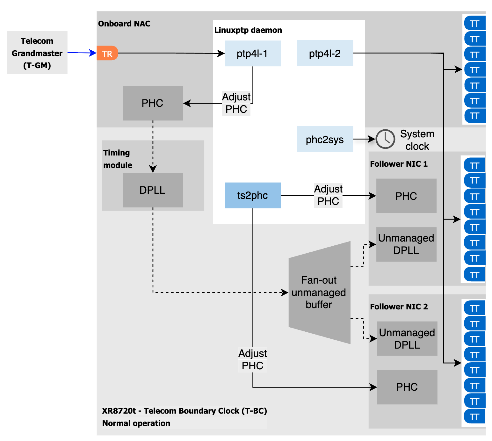
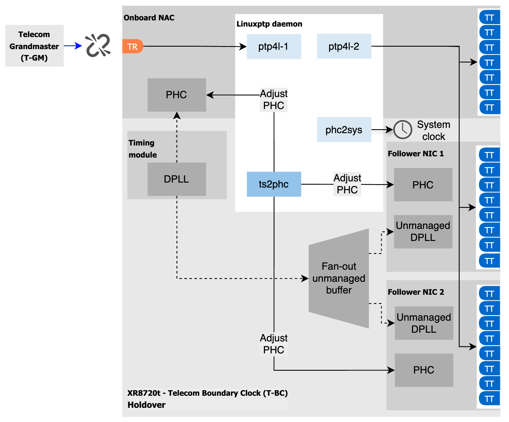

# Configuring T-BC / T-TSC on Dell XR8720t platform

This document describes how to configure and operate T-BC / T-TSC with holdover support on the Dell XR8720t platform.

## How it works

In the T-BC configuration linuxptp-daemon will launch two `ptp4l` instances: one instance for the TR port, and another instance for all the TT ports. The internal NAC that owns the TR port leads the timing of the entire system. With two add-on follower cards, this configuration supports up to 23 TT ports.
The diagram of the normal T-BC operation is shown below:



The `ts2phc` will monitor the `ptp4l` instance bound to the TR port. If the TR port stops operating as the time receiver (for example, if the upstream T-GM deteriorates in quality or the link disconnects), the system will enter holdover and dynamically reconfigure as shown below:



## Configure

A Triple-NIC T-BC configuration example is shown below. 
The `PtpConfig` resource contains two profiles:
- a profile for the time transmitter ports (`00-tbc-tt`)
- a profile configuring the TR port, `ts2phc` and `phc2sys`.

In addition, a `HardwareConfig` resource is required to configure the hardware.

The system also requires a `MachineConfig resource to configure the network interface names according to the `path` name  policy.

### PtpConfig
```yaml
apiVersion: ptp.openshift.io/v1
kind: PtpConfig
metadata:
  name: t-bc
  namespace: openshift-ptp
spec:
  profile:
  - name: 00-tbc-tt
    ptp4lConf: |
      [eno8803]
      masterOnly 1
      [eno8903]
      masterOnly 1
      [eno9003]
      masterOnly 1
      [eno8303]
      masterOnly 1
      [eno8403]
      masterOnly 1
      [eno8503]
      masterOnly 1
      [eno8603]
      masterOnly 1
      [enp108s0f0]
      masterOnly 1
      [enp108s0f1]
      masterOnly 1
      [enp108s0f2]
      masterOnly 1
      [enp108s0f3]
      masterOnly 1
      [enp108s0f4]
      masterOnly 1
      [enp108s0f5]
      masterOnly 1
      [enp108s0f6]
      masterOnly 1
      [enp108s0f7]
      masterOnly 1
      [enp109s0f0]
      masterOnly 1
      [enp109s0f1]
      masterOnly 1
      [enp109s0f2]
      masterOnly 1
      [enp109s0f3]
      masterOnly 1
      [enp109s0f4]
      masterOnly 1
      [enp109s0f5]
      masterOnly 1
      [enp109s0f6]
      masterOnly 1
      [enp109s0f7]
      masterOnly 1
      [global]
      #
      # Default Data Set
      #
      twoStepFlag 1
      slaveOnly 0
      priority1 128
      priority2 128
      domainNumber 24
      #utc_offset 37
      clockClass 248
      clockAccuracy 0xFE
      offsetScaledLogVariance 0xFFFF
      free_running 0
      freq_est_interval 1
      dscp_event 0
      dscp_general 0
      dataset_comparison G.8275.x
      G.8275.defaultDS.localPriority 128
      #
      # Port Data Set
      #
      logAnnounceInterval -3
      logSyncInterval -4
      logMinDelayReqInterval -4
      logMinPdelayReqInterval -4
      announceReceiptTimeout 3
      syncReceiptTimeout 0
      delayAsymmetry 0
      fault_reset_interval -4
      neighborPropDelayThresh 20000000
      masterOnly 0
      G.8275.portDS.localPriority 128
      #
      # Run time options
      #
      assume_two_step 0
      logging_level 6
      path_trace_enabled 0
      follow_up_info 0
      hybrid_e2e 0
      inhibit_multicast_service 0
      net_sync_monitor 0
      tc_spanning_tree 0
      tx_timestamp_timeout 50
      unicast_listen 0
      unicast_master_table 0
      unicast_req_duration 3600
      use_syslog 1
      verbose 0
      summary_interval 0
      kernel_leap 1
      check_fup_sync 0
      clock_class_threshold 135
      #
      # Servo Options
      #
      pi_proportional_const 0.60
      pi_integral_const 0.001
      pi_proportional_scale 0.0
      pi_proportional_exponent -0.3
      pi_proportional_norm_max 0.7
      pi_integral_scale 0.0
      pi_integral_exponent 0.4
      pi_integral_norm_max 0.3
      step_threshold 2.0
      # end T-BC experiment
      first_step_threshold 0.00002
      max_frequency 900000000
      clock_servo pi
      sanity_freq_limit 200000000
      ntpshm_segment 0
      #
      # Transport options
      #
      transportSpecific 0x0
      ptp_dst_mac 01:1B:19:00:00:00
      p2p_dst_mac 01:80:C2:00:00:0E
      udp_ttl 1
      udp6_scope 0x0E
      uds_address /var/run/ptp4l
      #
      # Default interface options
      #
      clock_type BC
      network_transport L2
      delay_mechanism E2E
      time_stamping hardware
      tsproc_mode filter
      delay_filter moving_median
      delay_filter_length 10
      egressLatency 0
      ingressLatency 0
      boundary_clock_jbod 1
      #
      # Clock description
      #
      productDescription ;;
      revisionData ;;
      manufacturerIdentity 00:00:00
      userDescription ;
      timeSource 0xA0
    ptp4lOpts: -2 --summary_interval -4
    ptpSchedulingPolicy: SCHED_FIFO
    ptpSchedulingPriority: 10
    ptpSettings:
      controllingProfile: 01-tbc-tr
      logReduce: "false"
  - name: 01-tbc-tr
    phc2sysOpts: -r -n 24 -N 8 -R 16 -u 0 -m -s eno8703
    ptp4lConf: |
      # The interface name is hardware-specific
      [eno8703]
      masterOnly 0
      [global]
      #
      # Default Data Set
      #
      twoStepFlag 1
      slaveOnly 0
      priority1 128
      priority2 128
      domainNumber 24
      #utc_offset 37
      clockClass 248
      clockAccuracy 0xFE
      offsetScaledLogVariance 0xFFFF
      free_running 0
      freq_est_interval 1
      dscp_event 0
      dscp_general 0
      dataset_comparison G.8275.x
      G.8275.defaultDS.localPriority 128
      #
      # Port Data Set
      #
      logAnnounceInterval -3
      logSyncInterval -4
      logMinDelayReqInterval -4
      logMinPdelayReqInterval -4
      announceReceiptTimeout 3
      syncReceiptTimeout 0
      delayAsymmetry 0
      fault_reset_interval -4
      neighborPropDelayThresh 20000000
      masterOnly 0
      G.8275.portDS.localPriority 128
      #
      # Run time options
      #
      assume_two_step 0
      logging_level 6
      path_trace_enabled 0
      follow_up_info 0
      hybrid_e2e 0
      inhibit_multicast_service 0
      net_sync_monitor 0
      tc_spanning_tree 0
      tx_timestamp_timeout 50
      unicast_listen 0
      unicast_master_table 0
      unicast_req_duration 3600
      use_syslog 1
      verbose 0
      summary_interval 0
      kernel_leap 1
      check_fup_sync 0
      clock_class_threshold 135
      #
      # Servo Options
      #
      pi_proportional_const 0.60
      pi_integral_const 0.001
      pi_proportional_scale 0.0
      pi_proportional_exponent -0.3
      pi_proportional_norm_max 0.7
      pi_integral_scale 0.0
      pi_integral_exponent 0.4
      pi_integral_norm_max 0.3
      step_threshold 2.0
      # end T-BC experiment
      first_step_threshold 0.00002
      max_frequency 900000000
      clock_servo pi
      sanity_freq_limit 200000000
      ntpshm_segment 0
      #
      # Transport options
      #
      transportSpecific 0x0
      ptp_dst_mac 01:1B:19:00:00:00
      p2p_dst_mac 01:80:C2:00:00:0E
      udp_ttl 1
      udp6_scope 0x0E
      uds_address /var/run/ptp4l
      #
      # Default interface options
      #
      clock_type OC
      network_transport L2
      delay_mechanism E2E
      time_stamping hardware
      tsproc_mode filter
      delay_filter moving_median
      delay_filter_length 10
      egressLatency 0
      ingressLatency 0
      boundary_clock_jbod 1
      #
      # Clock description
      #
      productDescription ;;
      revisionData ;;
      manufacturerIdentity 00:00:00
      userDescription ;
      timeSource 0xA0
    ptp4lOpts: -2 --summary_interval -4
    ptpSchedulingPolicy: SCHED_FIFO
    ptpSchedulingPriority: 10
    ptpSettings:
      clockType: T-BC
      inSyncConditionThreshold: "10"
      inSyncConditionTimes: "12"
      logReduce: "false"
    ts2phcConf: |
      [global]
      use_syslog  0
      verbose 1
      logging_level 7
      ts2phc.pulsewidth 500000000
      leapfile  /usr/share/zoneinfo/leap-seconds.list
      domainNumber 24
      uds_address /var/run/ptp4l.1.socket
      [eno8703]
      ts2phc.extts_correction 0
      ts2phc.master 0
      ts2phc.channel 0
      ts2phc.pin_index 1
      [enp108s0f0]
      ts2phc.extts_correction 0
      ts2phc.master 0
      ts2phc.channel 0
      ts2phc.pin_index 1
      [enp109s0f0]
      ts2phc.extts_polarity rising
      ts2phc.extts_correction 0
      ts2phc.master 0
      ts2phc.channel 0
      ts2phc.pin_index 1
    ts2phcOpts: -s generic -a --ts2phc.rh_external_pps 1
  recommend:
  - match:
    - nodeLabel: node-role.kubernetes.io/master
    priority: 4
    profile: 00-tbc-tt
  - match:
    - nodeLabel: node-role.kubernetes.io/master
    priority: 4
    profile: 01-tbc-tr

```

### HardwareConfig

```yaml
apiVersion: ptp.openshift.io/v2alpha1
kind: HardwareConfig
metadata:
  name: t-bc
spec:
  profile:
    name: GNR-D-T-BC
    clockType: T-BC
    clockChain:
      structure:
      - name: leader
        hardwareSpecificDefinitions: dell/XR8720t
        dpll:
          holdoverParameters:
            maxInSpecOffset: 40
            localMaxHoldoverOffset: 1500
            localHoldoverTimeout: 14400
  relatedPtpProfileName: 01-tbc-tr

```

### Network interface names

```yaml
apiVersion: machineconfiguration.openshift.io/v1
kind: MachineConfig
metadata:
  name: 10-rename-gnrd-interfaces-master
  labels:
    machineconfiguration.openshift.io/role: master
spec:
  config:
    ignition:
      version: 3.2.0
    storage:
      files:
        - path: /etc/systemd/network/10-interface-8086-12d3.link
          # [Match]
          # Property=ID_VENDOR_ID=0x8086
          # Property=ID_MODEL_ID=0x12d3
          # [Link]
          # NamePolicy=path
          mode: 420
          overwrite: true
          contents:
            source: data:text/plain,%5BMatch%5D%0AProperty%3DID_VENDOR_ID%3D0x8086%0AProperty%3DID_MODEL_ID%3D0x12d3%0A%0A%5BLink%5D%0ANamePolicy%3Dpath%0A
```
