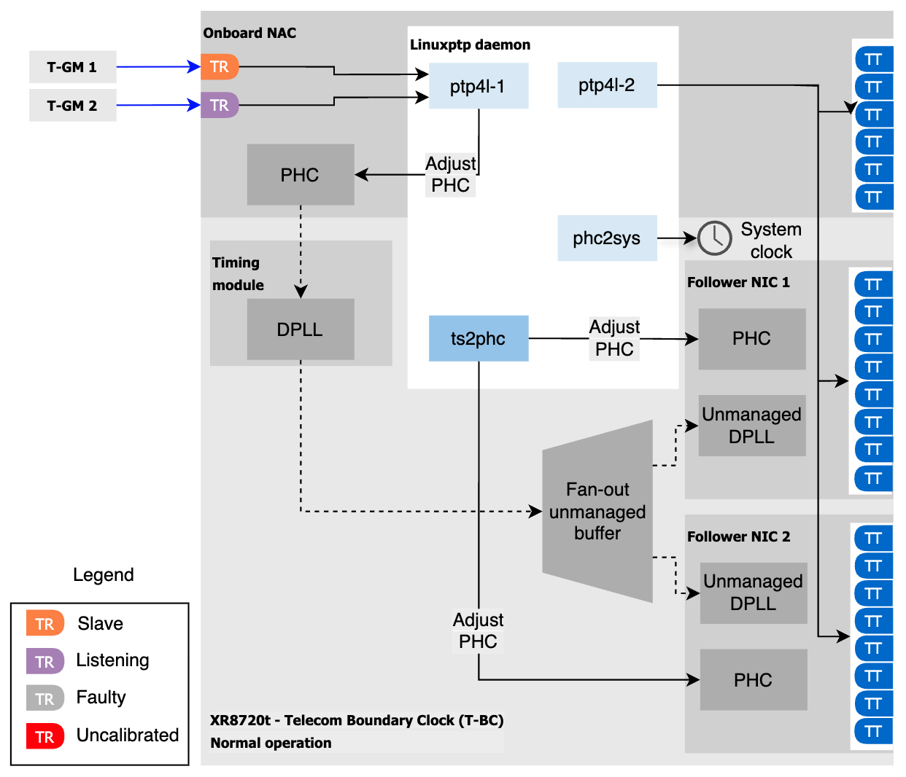
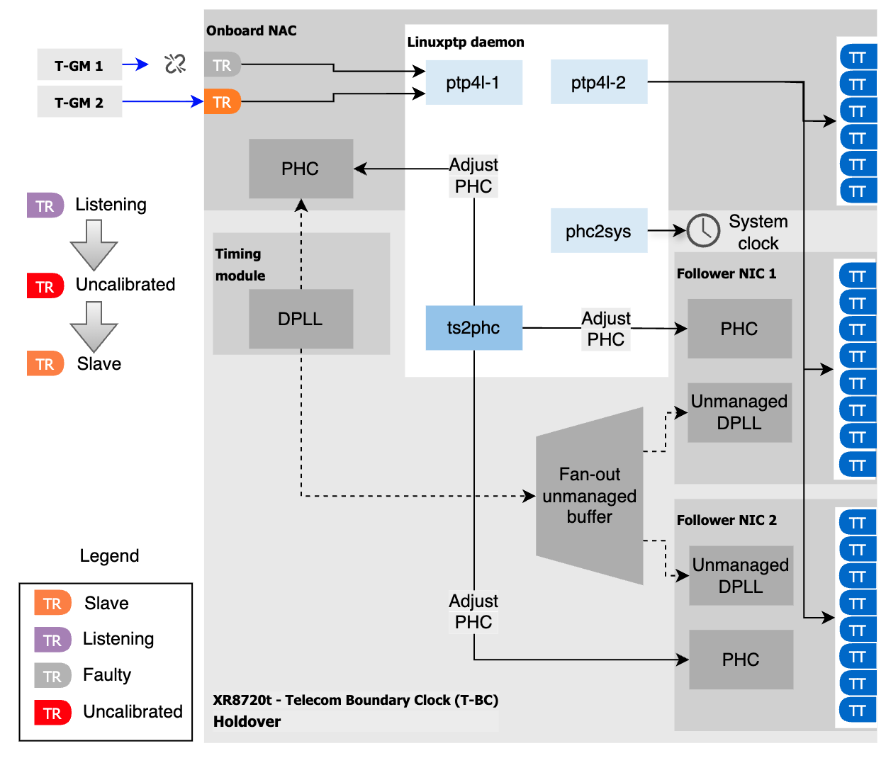
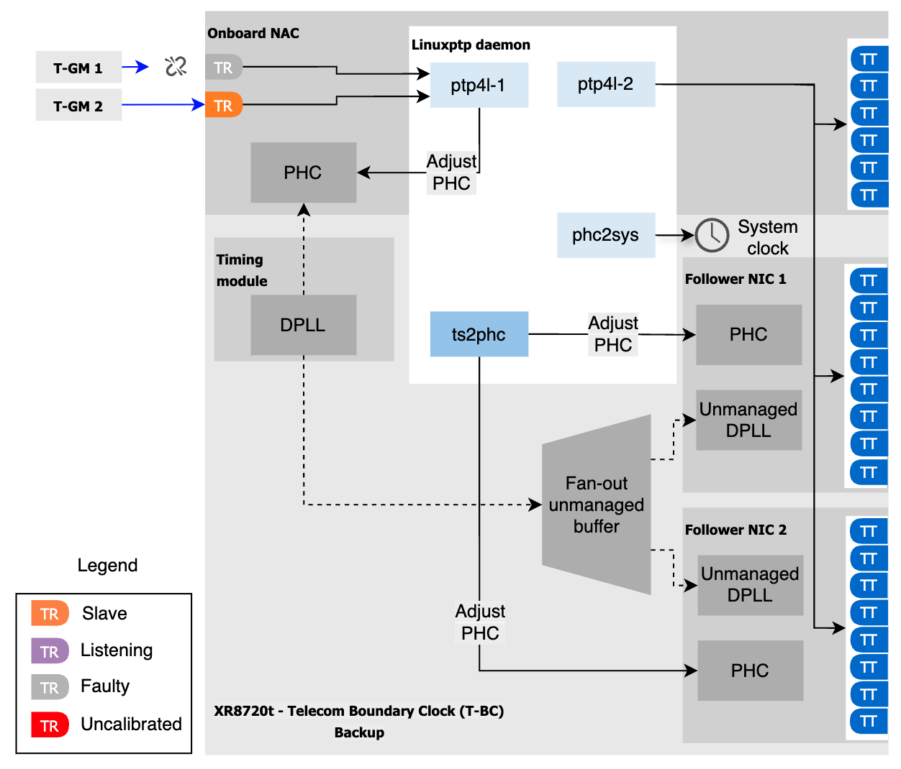

# Feature Spec: Dual-Upstream Telecom Boundary Clock (T-BC)

## Status: Implemented

## Overview

A Telecom Boundary Clock (T-BC) node can be configured with two upstream PTP ports facing
two independent grandmaster sources. One port is the active upstream reference (SLAVE); the
other is the standby backup (LISTENING or MASTER, depending on BMCA outcome). When the active
upstream link fails, ptp4l performs automatic failover to the backup port. When the original
link recovers, ptp4l reinstates it as the active SLAVE.

This document describes the dual-upstream T-BC topology, its configuration, and the port
role metric behavior during normal operation, failover, and recovery.

---

## Topology
### Normal operation



The T-BC node runs two ptp4l instances:

| ptp4l instance | Role | Interfaces |
|---|---|---|
| `ptp4l.1.config` (`01-tbc-tr`) | Upstream receiver | `eno8303`, `eno8403` |
| `ptp4l.0.config` (`00-tbc-tt`) | Downstream transmitter | `eno8503`, `enp108s0f0`, `enp108s0f1`, `enp110s0f0`, `enp110s0f1` |

The upstream instance (`01-tbc-tr`) runs in Ordinary Clock mode (`clock_type OC`) with both
upstream ports set to `masterOnly 0`, allowing either port to become SLAVE. The downstream
instance (`00-tbc-tt`) runs in Boundary Clock mode (`clock_type BC`) with all ports set to
`masterOnly 1`, serving downstream clocks.

---

## Port Role Behavior

### Normal Operation

ptp4l runs BMCA across both upstream ports. The port with the better upstream clock wins
SLAVE; the other port transitions to MASTER (serving as a local reference backup) or
LISTENING, depending on the upstream clock quality.

In the observed configuration:

| Interface | ptp4l state | Metric value |
|---|---|---|
| `eno8303` | SLAVE | 1 |
| `eno8403` | MASTER | 2 |

### Failover (Active Upstream Link Down)

When `eno8303` loses its link, ptp4l transitions the backup port through the IEEE 1588 BMCA
states ((MASTER - optional) → LISTENING → UNCALIBRATED → SLAVE) before it takes over as the active reference:




### Qualification
When the new TR port is qualified, DPLL input is enabled.
After DPLL locks and all offsets in the system are qualified, backup state is reached.



### Recovery (Active Upstream Link Restored)

Recovery starts when the original TR ports regains the adjacency to its reference. The operation order is the same: A-BMCA selects the new TR port and a brief holdover while the system stabilizes.
---

## Configuration

### PtpConfig (`t-bc-dual-upstream.yaml`)

The dual-upstream T-BC requires two PTP profiles in a single `PtpConfig` resource:

**Profile `01-tbc-tr`** — upstream receiver (controls `eno8303` and `eno8403`):
- `clock_type OC` — runs as Ordinary Clock; BMCA selects which upstream port becomes SLAVE
- `masterOnly 0` on both upstream interfaces — either port can become SLAVE
- `ts2phcOpts: -s generic -a --ts2phc.rh_external_pps 1` — identifies this as a T-BC profile
- `ptpSettings.clockType: T-BC`
- `phc2sysOpts: -r -w -n 24 -N 8 -R 16 -u 0 -m -s eno8703` — syncs system clock via GNSS 1PPS

**Profile `00-tbc-tt`** — downstream transmitter (controls all downstream ports):
- `clock_type BC` — runs as Boundary Clock
- `masterOnly 1` on all downstream interfaces
- `ptpSettings.controllingProfile: 01-tbc-tr` — links this profile to the upstream receiver

```yaml
apiVersion: ptp.openshift.io/v1
kind: PtpConfig
metadata:
  name: t-bc
  namespace: openshift-ptp
spec:
  profile:
  - name: 00-tbc-tt
    ptp4lConf: |
      [eno8503]
      masterOnly 1
      [enp108s0f0]
      masterOnly 1
      [enp108s0f1]
      masterOnly 1
      [enp110s0f0]
      masterOnly 1
      [enp110s0f1]
      masterOnly 1
      [global]
      #
      # Default Data Set
      #
      twoStepFlag 1
      slaveOnly 0
      priority1 128
      priority2 128
      domainNumber 24
      clockClass 248
      clockAccuracy 0xFE
      offsetScaledLogVariance 0xFFFF
      free_running 0
      freq_est_interval 1
      dscp_event 0
      dscp_general 0
      dataset_comparison G.8275.x
      G.8275.defaultDS.localPriority 128
      #
      # Port Data Set
      #
      logAnnounceInterval -3
      logSyncInterval -4
      logMinDelayReqInterval -4
      logMinPdelayReqInterval -4
      announceReceiptTimeout 3
      syncReceiptTimeout 0
      delayAsymmetry 0
      fault_reset_interval -4
      neighborPropDelayThresh 20000000
      masterOnly 0
      G.8275.portDS.localPriority 128
      #
      # Run time options
      #
      assume_two_step 0
      logging_level 6
      path_trace_enabled 0
      follow_up_info 0
      hybrid_e2e 0
      inhibit_multicast_service 0
      net_sync_monitor 0
      tc_spanning_tree 0
      tx_timestamp_timeout 50
      unicast_listen 0
      unicast_master_table 0
      unicast_req_duration 3600
      use_syslog 1
      verbose 0
      summary_interval 0
      kernel_leap 1
      check_fup_sync 0
      clock_class_threshold 135
      #
      # Servo Options
      #
      pi_proportional_const 0.60
      pi_integral_const 0.001
      pi_proportional_scale 0.0
      pi_proportional_exponent -0.3
      pi_proportional_norm_max 0.7
      pi_integral_scale 0.0
      pi_integral_exponent 0.4
      pi_integral_norm_max 0.3
      step_threshold 2.0
      first_step_threshold 0.00002
      max_frequency 900000000
      clock_servo pi
      sanity_freq_limit 200000000
      ntpshm_segment 0
      #
      # Transport options
      #
      transportSpecific 0x0
      ptp_dst_mac 01:1B:19:00:00:00
      p2p_dst_mac 01:80:C2:00:00:0E
      udp_ttl 1
      udp6_scope 0x0E
      uds_address /var/run/ptp4l
      #
      # Default interface options
      #
      clock_type BC
      network_transport L2
      delay_mechanism E2E
      time_stamping hardware
      tsproc_mode filter
      delay_filter moving_median
      delay_filter_length 10
      egressLatency 0
      ingressLatency 0
      boundary_clock_jbod 1
      #
      # Clock description
      #
      productDescription ;;
      revisionData ;;
      manufacturerIdentity 00:00:00
      userDescription ;
      timeSource 0xA0
    ptp4lOpts: -2 --summary_interval -4
    ptpSchedulingPolicy: SCHED_FIFO
    ptpSchedulingPriority: 10
    ptpSettings:
      controllingProfile: 01-tbc-tr
      logReduce: "false"

  - name: 01-tbc-tr
    phc2sysOpts: -r -w -n 24 -N 8 -R 16 -u 0 -m -s eno8703
    ptp4lConf: |
      # The interface name is hardware-specific
      [eno8303]
      masterOnly 0
      [eno8403]
      masterOnly 0
      [global]
      #
      # Default Data Set
      #
      twoStepFlag 1
      slaveOnly 0
      priority1 128
      priority2 128
      domainNumber 24
      clockClass 248
      clockAccuracy 0xFE
      offsetScaledLogVariance 0xFFFF
      free_running 0
      freq_est_interval 1
      dscp_event 0
      dscp_general 0
      dataset_comparison G.8275.x
      G.8275.defaultDS.localPriority 128
      #
      # Port Data Set
      #
      logAnnounceInterval -3
      logSyncInterval -4
      logMinDelayReqInterval -4
      logMinPdelayReqInterval -4
      announceReceiptTimeout 3
      syncReceiptTimeout 0
      delayAsymmetry 0
      fault_reset_interval -4
      neighborPropDelayThresh 20000000
      masterOnly 0
      G.8275.portDS.localPriority 128
      #
      # Run time options
      #
      assume_two_step 0
      logging_level 6
      path_trace_enabled 0
      follow_up_info 0
      hybrid_e2e 0
      inhibit_multicast_service 0
      net_sync_monitor 0
      tc_spanning_tree 0
      tx_timestamp_timeout 50
      unicast_listen 0
      unicast_master_table 0
      unicast_req_duration 3600
      use_syslog 1
      verbose 0
      summary_interval 0
      kernel_leap 1
      check_fup_sync 0
      clock_class_threshold 135
      #
      # Servo Options
      #
      pi_proportional_const 0.60
      pi_integral_const 0.001
      pi_proportional_scale 0.0
      pi_proportional_exponent -0.3
      pi_proportional_norm_max 0.7
      pi_integral_scale 0.0
      pi_integral_exponent 0.4
      pi_integral_norm_max 0.3
      step_threshold 2.0
      first_step_threshold 0.00002
      max_frequency 900000000
      clock_servo pi
      sanity_freq_limit 200000000
      ntpshm_segment 0
      #
      # Transport options
      #
      transportSpecific 0x0
      ptp_dst_mac 01:1B:19:00:00:00
      p2p_dst_mac 01:80:C2:00:00:0E
      udp_ttl 1
      udp6_scope 0x0E
      uds_address /var/run/ptp4l
      #
      # Default interface options
      #
      clock_type OC
      network_transport L2
      delay_mechanism E2E
      time_stamping hardware
      tsproc_mode filter
      delay_filter moving_median
      delay_filter_length 10
      egressLatency 0
      ingressLatency 0
      boundary_clock_jbod 1
      #
      # Clock description
      #
      productDescription ;;
      revisionData ;;
      manufacturerIdentity 00:00:00
      userDescription ;
      timeSource 0xA0
    ptp4lOpts: -2 --summary_interval -4
    ptpSchedulingPolicy: SCHED_FIFO
    ptpSchedulingPriority: 10
    ptpSettings:
      clockType: T-BC
      inSyncConditionThreshold: "10"
      inSyncConditionTimes: "12"
      logReduce: "false"
    ts2phcConf: |
      [global]
      use_syslog  0
      verbose 1
      logging_level 7
      ts2phc.pulsewidth 500000000
      leapfile  /usr/share/zoneinfo/leap-seconds.list
      domainNumber 24
      uds_address /var/run/ptp4l.1.socket
      [eno8703]
      ts2phc.extts_correction 0
      ts2phc.master 0
      ts2phc.channel 0
      ts2phc.pin_index 1
      [enp108s0f0]
      ts2phc.extts_correction 0
      ts2phc.master 0
      ts2phc.channel 0
      ts2phc.pin_index 1
      [enp110s0f0]
      ts2phc.extts_polarity rising
      ts2phc.extts_correction 0
      ts2phc.master 0
      ts2phc.channel 0
      ts2phc.pin_index 1
    ts2phcOpts: -s generic -a --ts2phc.rh_external_pps 1

  recommend:
  - match:
    - nodeLabel: node-role.kubernetes.io/master
    priority: 4
    profile: 00-tbc-tt
  - match:
    - nodeLabel: node-role.kubernetes.io/master
    priority: 4
    profile: 01-tbc-tr
```

### HardwareConfig (`hwconfig-830.yaml`)

The `HardwareConfig` resource associates the hardware profile with the PTP profile and
defines the DPLL clock chain for the E830 NIC:

```yaml
apiVersion: ptp.openshift.io/v2alpha1
kind: HardwareConfig
metadata:
  name: t-bc-e830
spec:
  profile:
    name: GNR-D-T-BC-E830
    clockType: T-BC
    clockChain:
      structure:
      - name: leader
        hardwareSpecificDefinitions: dell/XR8720t
        dpll:
          holdoverParameters:
            maxInSpecOffset: 20
            localMaxHoldoverOffset: 30
            localHoldoverTimeout: 288
      - name: cf1
        hardwareSpecificDefinitions: intel/e830
        dpll:
          networkInterface: enp108s0f0
      - name: cf2
        hardwareSpecificDefinitions: intel/e830
        dpll:
          networkInterface: enp110s0f0
  relatedPtpProfileName: 01-tbc-tr
```

---

## Verifying Port Role Metrics

After the node is synchronized, query the interface role metric from the daemon pod:

```bash
oc -c linuxptp-daemon-container rsh ds/linuxptp-daemon \
  curl -s localhost:9091/metrics | grep -E "eno8303|eno8403|HELP openshift_ptp_interface_role"
```

Expected output during normal operation:

```
# HELP openshift_ptp_interface_role 0 = PASSIVE, 1 = SLAVE, 2 = MASTER, 3 = FAULTY, 4 = UNKNOWN, 5 = LISTENING
openshift_ptp_interface_role{iface="eno8303",...,process="ptp4l"} 1
openshift_ptp_interface_role{iface="eno8403",...,process="ptp4l"} 2
```

To observe the ptp4l port state transitions in real time:

```bash
oc -c linuxptp-daemon-container logs ds/linuxptp-daemon \
  | grep ptp4l | grep " to " | grep -E "eno8403|eno8303"
```

---

## Port Role Metric Value Reference

| Value | Role | Description |
|---|---|---|
| 0 | PASSIVE | Port blocked by BMCA (alternate path) |
| 1 | SLAVE | Active upstream reference |
| 2 | MASTER | Serving downstream clocks |
| 3 | FAULTY | Hardware or protocol fault on port |
| 4 | UNKNOWN | Role cannot be determined |
| 5 | LISTENING | Listening for Announce messages; also reported during BMCA UNCALIBRATED phase |

---

## Known ptp4l Transition Sequences

### Port state transitions that update the metric

| Log pattern | Reported role | Notes |
|---|---|---|
| `UNCALIBRATED to SLAVE` | SLAVE (1) | Port locked to upstream |
| `LISTENING to SLAVE` | SLAVE (1) | Direct lock |
| `UNCALIBRATED to MASTER` | MASTER (2) | Port becomes downstream master |
| `LISTENING to PRE_MASTER` | MASTER (2) | Transient before MASTER |
| `UNCALIBRATED to PRE_MASTER` | MASTER (2) | Transient before MASTER |
| `PRE_MASTER to MASTER` | MASTER (2) | Full MASTER state |
| `SLAVE to PRE_MASTER` | MASTER (2) | BMCA re-selects this port as master |
| `SLAVE to FAULTY on FAULT_DETECTED` | FAULTY (3) | Explicit link/protocol fault |
| `FAULT_DETECTED` / `SYNCHRONIZATION_FAULT` | FAULTY (3) | Explicit fault |
| `SLAVE to UNCALIBRATED` | FAULTY (3) | Active-port fault preamble |
| `MASTER to UNCALIBRATED on RS_SLAVE` | LISTENING (5) | BMCA re-evaluation (not a fault) |
| `LISTENING to UNCALIBRATED on RS_SLAVE` | LISTENING (5) | BMCA re-evaluation (not a fault) |
| `FAULTY to LISTENING` | LISTENING (5) | Port recovered from fault |
| `INITIALIZING to LISTENING` | LISTENING (5) | Port initialized |

---

<!-- TODO: verify interface names (eno8303, eno8403, eno8703, eno8503, enp108s0f0, enp108s0f1, enp110s0f0, enp110s0f1) are correct for all target platforms or add a note that they are platform-specific -->

<!-- TODO: add a "Limitations and Known Issues" section once OCPBUGS-111881 is fully resolved and verified across all supported hardware variants -->

<!-- TODO: add a "Supported Hardware" section listing which NIC + platform combinations have been validated (e.g. Intel E830 on Dell XR8720t) -->

## Related Resources

- Bug fix: OCPBUGS-111881 — stale `openshift_ptp_interface_role` metrics in dual-upstream T-BC
