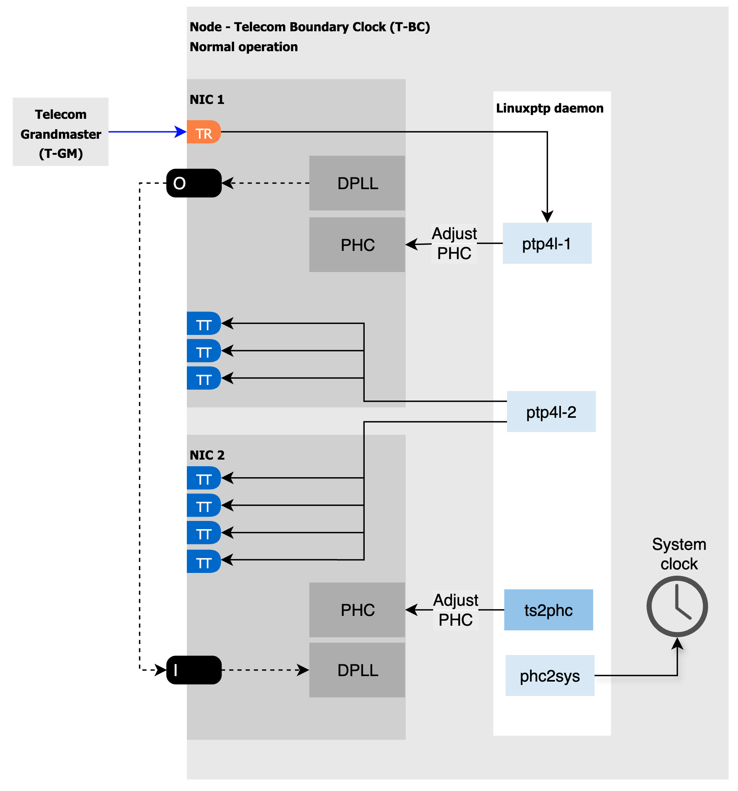

# Building and using T-BC / T-TSC Holdover technical preview

This repository contains a technical preview of T-BC / T-TSC holdover feature on Intel E810-XXV-4T NIC. The feature requires a special `ts2phc` build that is not yet publicly available, but [included in this repository](../extra/linuxptp-4.2-2.el9_4.4.test_extgm.x86_64.rpm) for testing purposes only. Use at your own risk!

## How it works

In the T-BC settings linuxptp-daemon will launch two `ptp4l` instances: one instance for the TR port, and another instance for all the TT ports. The NIC owning the TR port will lead the timing of the entire system, and if additional time transmitter ports are required, up to two additional NICs can be connected to the leading NIC through the on-board SMA connectors.
The diagram of the normal T-BC operation is shown below:



The `ts2phc` will monitor the `ptp4l` instance bound to the TR port. If the TR port stops operating as the time receiver (for example, if the upstream T-GM deteriorates in quality or the link disconnects), the system will enter holdover and dynamically reconfigure as shown below:


## Build
### Create a Dockerfile

To include the custom `ts2phc` build in the container image, the `Dockerfile` must be modified. For example:

```bash
FROM golang:1.24.0 AS builder
WORKDIR /go/src/github.com/k8snetworkplumbingwg/linuxptp-daemon
COPY . .
RUN make clean && make

FROM quay.io/centos/centos:stream9

COPY extra/linuxptp-4.2-2.el9_4.4.test_extgm.x86_64.rpm /
RUN yum -y update && yum -y update glibc && yum --setopt=skip_missing_names_on_install=False -y install /linuxptp-4.2-2.el9_4.4.test_extgm.x86_64.rpm ethtool hwdata synce4l gpsd-minimal gpsd-minimal-clients && yum clean all && \
	rm /linuxptp-4.2-2.el9_4.4.test_extgm.x86_64.rpm


RUN ln -s /usr/bin/gpspipe /usr/local/bin/gpspipe && ln -s /usr/sbin/gpsd /usr/local/sbin/gpsd && ln -s /usr/bin/ubxtool /usr/local/bin/ubxtool


COPY --from=builder /go/src/github.com/k8snetworkplumbingwg/linuxptp-daemon/bin/ptp /usr/local/bin/

CMD ["/usr/local/bin/ptp"]
```

### Build and push the image

```bash
podman build --arch=x86_64 --no-cache -t <your pull spec> -f Dockerfile.tbc . && podman push <your pull spec>
```

### Replace the stock image

Replace the `linuxptp-daemon` stock image by your custom image (the exact method depends on the environment used)

## Configure

A Triple-NIC T-BC configuration example is shown below. The `PtpConfig` resource contains two profiles:
- a profile for the time transmitter ports (`00-tbc-tt`)
- a profile configuring all the hardware, the TR port, `ts2phc` and `phc2sys`.

```yaml
apiVersion: ptp.openshift.io/v1
kind: PtpConfig
metadata:
  name: t-bc
  namespace: openshift-ptp
spec:
  profile:
  - name: 00-tbc-tt
    ptp4lConf: |
      [ens4f0]
      masterOnly 1
      [ens8f0]
      masterOnly 1
      [ens1f0]
      masterOnly 1
      [global]
      #
      # Default Data Set
      #
      twoStepFlag 1
      slaveOnly 0
      priority1 128
      priority2 128
      domainNumber 25
      clockClass 248
      clockAccuracy 0xFE
      offsetScaledLogVariance 0xFFFF
      free_running 0
      freq_est_interval 1
      dscp_event 0
      dscp_general 0
      dataset_comparison G.8275.x
      G.8275.defaultDS.localPriority 128
      #
      # Port Data Set
      #
      logAnnounceInterval -3
      logSyncInterval -4
      logMinDelayReqInterval -4
      logMinPdelayReqInterval -4
      announceReceiptTimeout 3
      syncReceiptTimeout 0
      delayAsymmetry 0
      fault_reset_interval -4
      neighborPropDelayThresh 20000000
      masterOnly 0
      G.8275.portDS.localPriority 128
      #
      # Run time options
      #
      assume_two_step 0
      logging_level 6
      path_trace_enabled 0
      follow_up_info 0
      hybrid_e2e 0
      inhibit_multicast_service 0
      net_sync_monitor 0
      tc_spanning_tree 0
      tx_timestamp_timeout 50
      unicast_listen 0
      unicast_master_table 0
      unicast_req_duration 3600
      use_syslog 1
      verbose 0
      summary_interval 0
      kernel_leap 1
      check_fup_sync 0
      clock_class_threshold 135
      #
      # Servo Options
      #
      pi_proportional_const 0.60
      pi_integral_const 0.001
      pi_proportional_scale 0.0
      pi_proportional_exponent -0.3
      pi_proportional_norm_max 0.7
      pi_integral_scale 0.0
      pi_integral_exponent 0.4
      pi_integral_norm_max 0.3
      step_threshold 2.0
      first_step_threshold 0.00002
      max_frequency 900000000
      clock_servo pi
      sanity_freq_limit 200000000
      ntpshm_segment 0
      #
      # Transport options
      #
      transportSpecific 0x0
      ptp_dst_mac 01:1B:19:00:00:00
      p2p_dst_mac 01:80:C2:00:00:0E
      udp_ttl 1
      udp6_scope 0x0E
      uds_address /var/run/ptp4l
      #
      # Default interface options
      #
      clock_type BC
      network_transport L2
      delay_mechanism E2E
      time_stamping hardware
      tsproc_mode filter
      delay_filter moving_median
      delay_filter_length 10
      egressLatency 0
      ingressLatency 0
      boundary_clock_jbod 1
      #
      # Clock description
      #
      productDescription ;;
      revisionData ;;
      manufacturerIdentity 00:00:00
      userDescription ;
      timeSource 0xA0
    ptp4lOpts: -2 --summary_interval -4
    ptpSchedulingPolicy: SCHED_FIFO
    ptpSchedulingPriority: 10
    ptpSettings:
      controllingProfile: 01-tbc-tr
      logReduce: "false"
  - name: 01-tbc-tr
    phc2sysOpts: -r -n 25 -N 8 -R 16 -u 0 -m -s ens4f1
    plugins:
      e810:
        enableDefaultConfig: false
        interconnections:
        - gnssInput: false
          id: ens4f0
          part: E810-XXVDA4T
          phaseOutputConnectors:
          - SMA1
          - SMA2
          upstreamPort: ens4f1
        - id: ens1f0
          inputConnector:
            connector: SMA1
          part: E810-XXVDA4T
        - id: ens8f0
          inputConnector:
            connector: SMA1
          part: E810-XXVDA4T
        pins:
          ens4f0:
            SMA1: 2 1
            SMA2: 2 2
            U.FL1: 0 1
            U.FL2: 0 2
          ens1f0:
            SMA1: 1 1
            SMA2: 0 2
            U.FL1: 0 1
            U.FL2: 0 2
          ens8f0:
            SMA1: 1 1
            SMA2: 0 2
            U.FL1: 0 1
            U.FL2: 0 2
        settings:
          LocalHoldoverTimeout: 14400
          LocalMaxHoldoverOffSet: 1500
          MaxInSpecOffset: 100
    ptp4lConf: |
      # The interface name is hardware-specific
      [ens4f1]
      masterOnly 0
      [global]
      #
      # Default Data Set
      #
      twoStepFlag 1
      slaveOnly 0
      priority1 128
      priority2 128
      domainNumber 25
      clockClass 248
      clockAccuracy 0xFE
      offsetScaledLogVariance 0xFFFF
      free_running 0
      freq_est_interval 1
      dscp_event 0
      dscp_general 0
      dataset_comparison G.8275.x
      G.8275.defaultDS.localPriority 128
      #
      # Port Data Set
      #
      logAnnounceInterval -3
      logSyncInterval -4
      logMinDelayReqInterval -4
      logMinPdelayReqInterval -4
      announceReceiptTimeout 3
      syncReceiptTimeout 0
      delayAsymmetry 0
      fault_reset_interval -4
      neighborPropDelayThresh 20000000
      masterOnly 0
      G.8275.portDS.localPriority 128
      #
      # Run time options
      #
      assume_two_step 0
      logging_level 6
      path_trace_enabled 0
      follow_up_info 0
      hybrid_e2e 0
      inhibit_multicast_service 0
      net_sync_monitor 0
      tc_spanning_tree 0
      tx_timestamp_timeout 50
      unicast_listen 0
      unicast_master_table 0
      unicast_req_duration 3600
      use_syslog 1
      verbose 0
      summary_interval 0
      kernel_leap 1
      check_fup_sync 0
      clock_class_threshold 135
      #
      # Servo Options
      #
      pi_proportional_const 0.60
      pi_integral_const 0.001
      pi_proportional_scale 0.0
      pi_proportional_exponent -0.3
      pi_proportional_norm_max 0.7
      pi_integral_scale 0.0
      pi_integral_exponent 0.4
      pi_integral_norm_max 0.3
      step_threshold 2.0
      first_step_threshold 0.00002
      max_frequency 900000000
      clock_servo pi
      sanity_freq_limit 200000000
      ntpshm_segment 0
      #
      # Transport options
      #
      transportSpecific 0x0
      ptp_dst_mac 01:1B:19:00:00:00
      p2p_dst_mac 01:80:C2:00:00:0E
      udp_ttl 1
      udp6_scope 0x0E
      uds_address /var/run/ptp4l
      #
      # Default interface options
      #
      clock_type OC
      network_transport L2
      delay_mechanism E2E
      time_stamping hardware
      tsproc_mode filter
      delay_filter moving_median
      delay_filter_length 10
      egressLatency 0
      ingressLatency 0
      boundary_clock_jbod 1
      #
      # Clock description
      #
      productDescription ;;
      revisionData ;;
      manufacturerIdentity 00:00:00
      userDescription ;
      timeSource 0xA0
    ptp4lOpts: -2 --summary_interval -4
    ptpSchedulingPolicy: SCHED_FIFO
    ptpSchedulingPriority: 10
    ptpSettings:
      inSyncConditionThreshold: "10"
      inSyncConditionTimes: "12"
      logReduce: "false"
    ts2phcConf: |
      [global]
      use_syslog  0
      verbose 1
      logging_level 7
      ts2phc.pulsewidth 100000000
      leapfile  /usr/share/zoneinfo/leap-seconds.list
      domainNumber 25
      uds_address /var/run/ptp4l.0.socket
      [ens4f0]
      ts2phc.extts_polarity rising
      ts2phc.extts_correction -10
      ts2phc.master 0
      [ens1f0]
      ts2phc.extts_polarity rising
      ts2phc.extts_correction -27
      ts2phc.master 0
      [ens8f0]
      ts2phc.extts_polarity rising
      ts2phc.extts_correction -27
      ts2phc.master 0
    ts2phcOpts: -s generic -a --ts2phc.rh_external_pps 1
  recommend:
  - match:
    - nodeLabel: node-role.kubernetes.io/master
    priority: 4
    profile: 00-tbc-tt
  - match:
    - nodeLabel: node-role.kubernetes.io/master
    priority: 4
    profile: 01-tbc-tr

```

### Pins and interconnections

The profile above is for a triple-NIC chain of clocks operating as a single boundary clock.

```yaml
        interconnections:
        - gnssInput: false
          id: ens4f0
          part: E810-XXVDA4T
          phaseOutputConnectors:
          - SMA1
          - SMA2
          upstreamPort: ens4f1
        - id: ens1f0
          inputConnector:
            connector: SMA1
          part: E810-XXVDA4T
        - id: ens8f0
          inputConnector:
            connector: SMA1
          part: E810-XXVDA4T
        pins:
          ens4f0:
            SMA1: 2 1
            SMA2: 2 2
            U.FL1: 0 1
            U.FL2: 0 2
          ens1f0:
            SMA1: 1 1
            SMA2: 0 2
            U.FL1: 0 1
            U.FL2: 0 2
          ens8f0:
            SMA1: 1 1
            SMA2: 0 2
            U.FL1: 0 1
            U.FL2: 0 2
```
Please note that the time receiver NIC (`id: ens4f0`) and the specific TR port (`upstreamPort: ens4f1`) have to be configured in both T-BC and T-TSC configurations
The pins API has to be set as well. In the single-NIC case, disable all the pins, or enable outputs if using for 1PPS measurements. 

### Configuring ts2phc

For `ts2phc` NIC sections in the configuration file must specify `ts2phc.master 0`. The command line options indicate the "generic" time source and the external PPS option `-a --ts2phc.rh_external_pps 1`.
To compensate for internal and external delays, use `ts2phc.extts_correction` setting per NIC.


```yaml
     ts2phcConf: |
      [global]
      use_syslog  0
      verbose 1
      logging_level 7
      ts2phc.pulsewidth 100000000
      leapfile  /usr/share/zoneinfo/leap-seconds.list
      domainNumber 25
      uds_address /var/run/ptp4l.0.socket
      [ens4f0]
      ts2phc.extts_polarity rising
      ts2phc.extts_correction -10
      ts2phc.master 0
      [ens1f0]
      ts2phc.extts_polarity rising
      ts2phc.extts_correction -27
      ts2phc.master 0
      [ens8f0]
      ts2phc.extts_polarity rising
      ts2phc.extts_correction -27
      ts2phc.master 0
    ts2phcOpts: -s generic -a --ts2phc.rh_external_pps 1
```

### Configuring ptp4l

Customizing ptp4l ports is done through the interface sections in the `ptp4lConf`. Only the TR port has `masterOnly 0`. All the TT ports must have `masterOnly 1`. 

### Configuring for T-TSC
To render this configuration for T-TSC operation, remove the `00-tbc-tt` profile and adjust the `ts2phcConf` section to list only the TR NIC.

## Testing

Entering and exiting the holdover can be tested by disabling the TR port on DUT, or disabling the ptp protocol on the T-GM / T-BC connected to it. The DPLL offsets can be monitored by netlink tooling, for example:

```bash
sudo podman run --privileged --network=host --rm quay.io/vgrinber/tools:dpll dpll-cli monitor |jq -r '"\(.boardLabel)\t\(.pinParentDevice[1].phaseOffsetPs)"'
``` 
