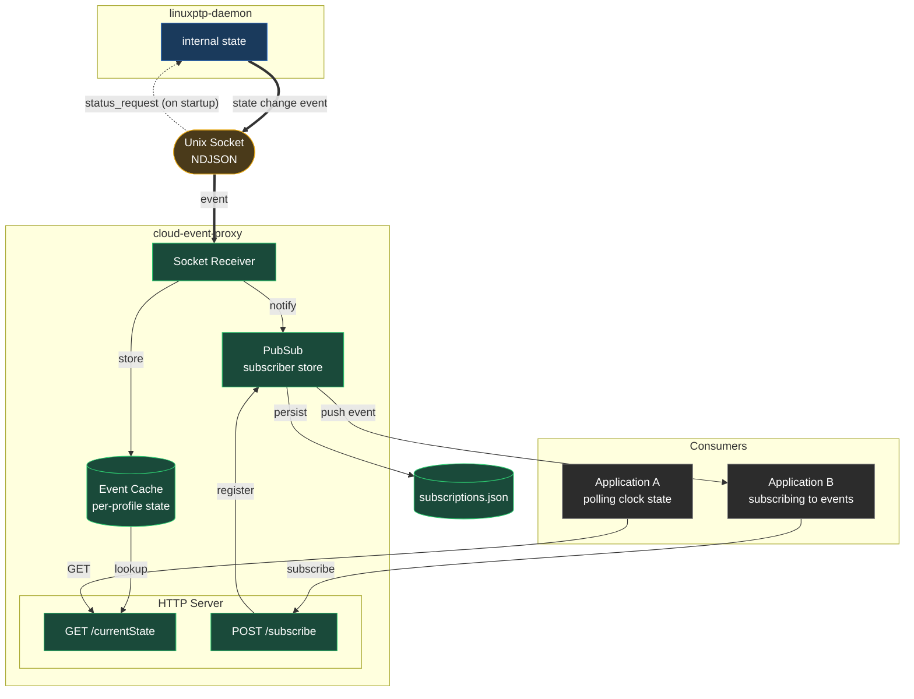

```mermaid
 flowchart TD
    subgraph daemon ["linuxptp-daemon"]
        procs["internal state"]
    end

    procs ==>|"state change event"| sock(["Unix Socket<br>NDJSON"])
    sock -.->|"status_request (on startup)"| procs

    sock ==>|"event"| receiver

    subgraph cep ["cloud-event-proxy"]
        receiver["Socket Receiver"]

        receiver -->|"store"| cache[("Event Cache<br>per-profile state")]
        receiver -->|"notify"| pubsub["PubSub<br>subscriber store"]

        subgraph http ["HTTP Server"]
            currentState["GET /currentState"]
            addSubscriber["POST /subscribe"]
        end

        cache -->|"lookup"| currentState
        addSubscriber -->|"register"| pubsub
    end

    pubsub -->|"push event"| sub
    pubsub -->|"persist"| subfile[("subscriptions.json")]

    subgraph consumers ["Consumers"]
        poll["Application A<br> polling clock state"]
        sub["Application B<br>subscribing to events"]
    end

    poll -->|"GET"| currentState
    sub -->|"subscribe"| addSubscriber

    classDef daemonStyle fill:#1a3a5c,stroke:#3a7bd5,color:#fff
    classDef cepStyle fill:#1a4a3a,stroke:#2ecc71,color:#fff
    classDef consumerStyle fill:#2c2c2c,stroke:#888,color:#fff
    classDef sockStyle fill:#4a3a1a,stroke:#e6a817,color:#fff

    class procs daemonStyle
    class receiver,cache,pubsub,subfile,currentState,addSubscriber cepStyle
    class poll,sub consumerStyle
    class sock sockStyle
```
